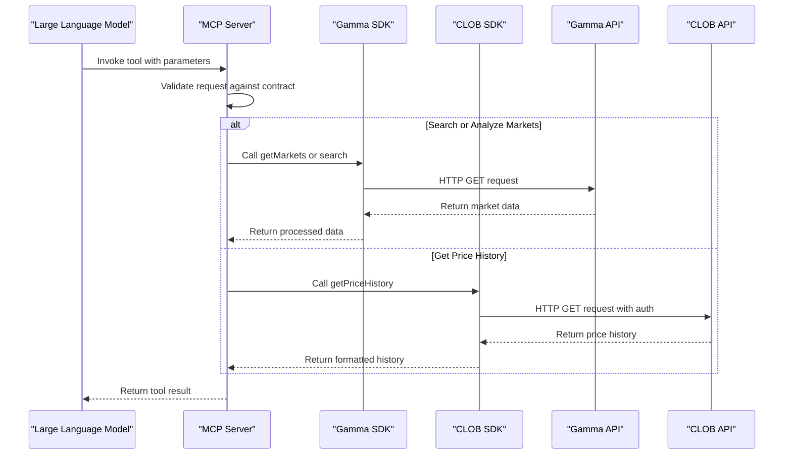
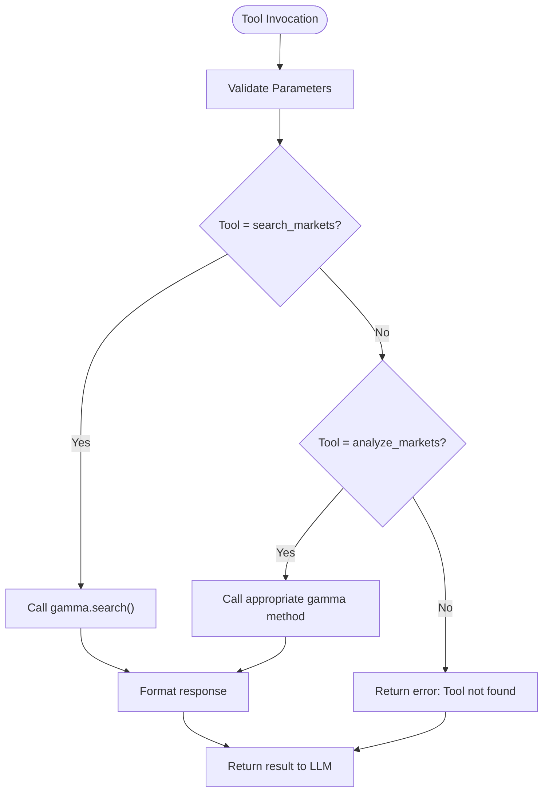
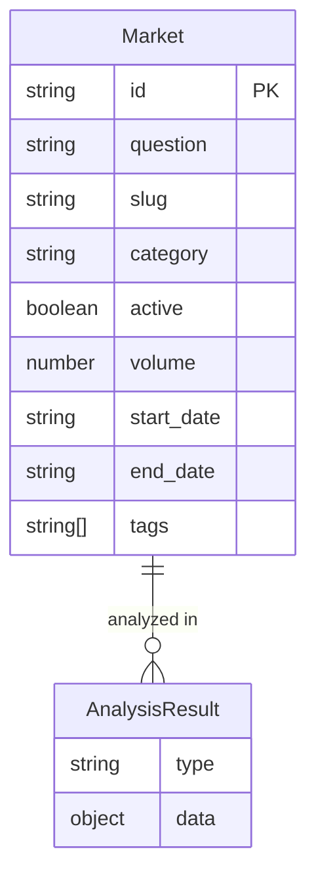
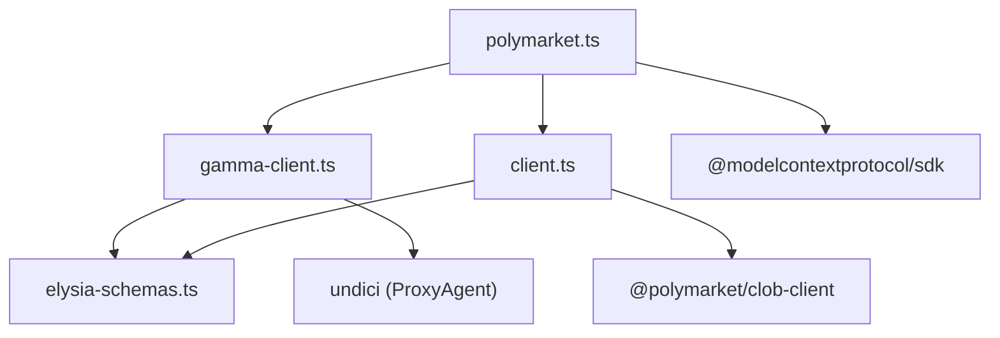

# MCP Server

<cite>
**Referenced Files in This Document**   
- [polymarket.ts](file://src/mcp/polymarket.ts)
- [polymarket-mcp.yml](file://specs/001-write-a-mcp/contracts/polymarket-mcp.yml)
- [gamma-client.ts](file://src/sdk/gamma-client.ts)
- [client.ts](file://src/sdk/client.ts)
- [elysia-schemas.ts](file://src/types/elysia-schemas.ts)
</cite>

## Table of Contents
1. [Introduction](#introduction)
2. [Project Structure](#project-structure)
3. [Core Components](#core-components)
4. [Architecture Overview](#architecture-overview)
5. [Detailed Component Analysis](#detailed-component-analysis)
6. [Dependency Analysis](#dependency-analysis)
7. [Performance Considerations](#performance-considerations)
8. [Troubleshooting Guide](#troubleshooting-guide)
9. [Conclusion](#conclusion)

## Introduction
The Model Context Protocol (MCP) server for Polymarket provides a natural language interface for querying and analyzing prediction market data. It enables Large Language Models (LLMs) to interact with Polymarket's data through standardized tools defined in the MCP protocol. The server integrates with both the Gamma and CLOB SDKs to fulfill user queries, allowing for comprehensive market analysis without requiring direct API knowledge. This document details the implementation, setup, usage patterns, and extension points for the MCP server.

## Project Structure
The MCP server is structured as a TypeScript application with a clear separation of concerns between the MCP interface, data SDKs, and type definitions. The core implementation resides in the `src/mcp` directory, while the supporting SDKs are located in `src/sdk`. The OpenAPI contract defining the available tools is stored in the `specs/001-write-a-mcp/contracts` directory.

```mermaid
graph TB
subgraph "MCP Server"
MCP[polymarket.ts] --> GammaSDK
MCP --> ClobSDK
end
subgraph "SDKs"
GammaSDK[gamma-client.ts] --> GammaAPI["Gamma API (gamma-api.polymarket.com)"]
ClobSDK[client.ts] --> ClobAPI["CLOB API (clob.polymarket.com)"]
end
subgraph "Contract"
Contract[polymarket-mcp.yml] --> MCP
end
subgraph "Types"
Types[elysia-schemas.ts] --> GammaSDK
Types --> ClobSDK
end
```

**Diagram sources**
- [polymarket.ts](file://src/mcp/polymarket.ts)
- [gamma-client.ts](file://src/sdk/gamma-client.ts)
- [client.ts](file://src/sdk/client.ts)
- [polymarket-mcp.yml](file://specs/001-write-a-mcp/contracts/polymarket-mcp.yml)
- [elysia-schemas.ts](file://src/types/elysia-schemas.ts)

**Section sources**
- [polymarket.ts](file://src/mcp/polymarket.ts)
- [gamma-client.ts](file://src/sdk/gamma-client.ts)
- [client.ts](file://src/sdk/client.ts)

## Core Components
The MCP server's core components include the MCP server instance, the Gamma SDK for public data access, and the CLOB SDK for authenticated operations. The server exposes tools defined in the OpenAPI contract that map to specific SDK methods, enabling LLMs to perform complex queries through natural language.

**Section sources**
- [polymarket.ts](file://src/mcp/polymarket.ts)
- [gamma-client.ts](file://src/sdk/gamma-client.ts)
- [client.ts](file://src/sdk/client.ts)

## Architecture Overview
The MCP server architecture follows a client-server model where the server exposes tools defined in the OpenAPI contract. When an LLM invokes a tool, the server routes the request to the appropriate SDK method, which then communicates with the respective Polymarket API. The response is formatted according to the contract and returned to the LLM.



**Diagram sources**
- [polymarket.ts](file://src/mcp/polymarket.ts)
- [gamma-client.ts](file://src/sdk/gamma-client.ts)
- [client.ts](file://src/sdk/client.ts)
- [polymarket-mcp.yml](file://specs/001-write-a-mcp/contracts/polymarket-mcp.yml)

## Detailed Component Analysis

### MCP Server Implementation
The MCP server implementation in `polymarket.ts` creates a server instance that exposes tools for searching and analyzing markets. It uses the Gamma SDK to access public market data and can be extended to use the CLOB SDK for price history and trading data.

```mermaid
classDiagram
class McpServer {
+string name
+string version
+object capabilities
+connect(transport) Promise
}
class GammaSDK {
+getMarkets(query) Promise~MarketType[]~
+search(query) Promise~SearchResponseType~
+getEvents(query) Promise~EventType[]~
}
class PolymarketSDK {
+getPriceHistory(query) Promise~PriceHistoryResponse~
+getBook(tokenId) Promise~OrderBookSummary~
+healthCheck() Promise~HealthResponse~
}
McpServer --> GammaSDK : "uses"
McpServer --> PolymarketSDK : "uses"
GammaSDK --> "gamma-api.polymarket.com" : "HTTP"
PolymarketSDK --> "clob.polymarket.com" : "HTTP"
```

**Diagram sources**
- [polymarket.ts](file://src/mcp/polymarket.ts)
- [gamma-client.ts](file://src/sdk/gamma-client.ts)
- [client.ts](file://src/sdk/client.ts)

#### Tool Implementation
The tools exposed by the MCP server are defined in the OpenAPI contract and implemented using the SDK methods. The `search_markets` tool uses the Gamma SDK's search functionality, while the `analyze_markets` tool can use various Gamma SDK methods to perform analysis.



**Diagram sources**
- [polymarket.ts](file://src/mcp/polymarket.ts)
- [gamma-client.ts](file://src/sdk/gamma-client.ts)
- [polymarket-mcp.yml](file://specs/001-write-a-mcp/contracts/polymarket-mcp.yml)

**Section sources**
- [polymarket.ts](file://src/mcp/polymarket.ts)
- [gamma-client.ts](file://src/sdk/gamma-client.ts)

### Contract Definition
The OpenAPI contract in `polymarket-mcp.yml` defines the available tools and their parameters. It specifies two main endpoints: `search_markets` for finding markets based on various criteria, and `analyze_markets` for performing analytical queries on market data.



**Diagram sources**
- [polymarket-mcp.yml](file://specs/001-write-a-mcp/contracts/polymarket-mcp.yml)

**Section sources**
- [polymarket-mcp.yml](file://specs/001-write-a-mcp/contracts/polymarket-mcp.yml)

## Dependency Analysis
The MCP server has dependencies on the Gamma SDK for public data access and the CLOB SDK for authenticated operations. Both SDKs depend on the `elysia-schemas` for type definitions and validation. The server itself depends on the Model Context Protocol SDK for the server implementation.



**Diagram sources**
- [polymarket.ts](file://src/mcp/polymarket.ts)
- [gamma-client.ts](file://src/sdk/gamma-client.ts)
- [client.ts](file://src/sdk/client.ts)
- [elysia-schemas.ts](file://src/types/elysia-schemas.ts)

**Section sources**
- [polymarket.ts](file://src/mcp/polymarket.ts)
- [gamma-client.ts](file://src/sdk/gamma-client.ts)
- [client.ts](file://src/sdk/client.ts)

## Performance Considerations
The MCP server implements caching for CLOB client instances to reduce initialization overhead. The Gamma SDK does not implement caching as it accesses public endpoints that are already optimized. Rate limiting should be considered when deploying the server to production to prevent abuse.

## Troubleshooting Guide
Common issues with the MCP server include authentication failures with the CLOB SDK and rate limiting from the Polymarket APIs. The server provides health check endpoints through the SDKs to verify connectivity.

**Section sources**
- [client.ts](file://src/sdk/client.ts)
- [gamma-client.ts](file://src/sdk/gamma-client.ts)

## Conclusion
The Polymarket MCP server provides a powerful natural language interface for accessing and analyzing prediction market data. By leveraging the Gamma and CLOB SDKs, it exposes a rich set of tools that enable LLMs to perform complex queries without requiring direct API knowledge. The server can be extended with additional tools and integrated with various LLM platforms to provide a seamless user experience.