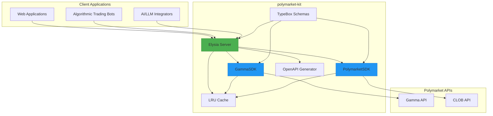
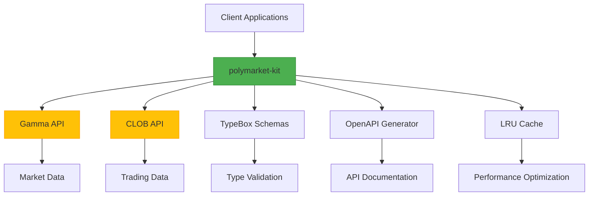

# Project Overview

<cite>
**Referenced Files in This Document**   
- [README.md](file://README.md)
- [index.ts](file://src/index.ts)
- [gamma.ts](file://src/routes/gamma.ts)
- [clob.ts](file://src/routes/clob.ts)
- [gamma-client.ts](file://src/sdk/gamma-client.ts)
- [client.ts](file://src/client.ts)
- [elysia-schemas.ts](file://src/types/elysia-schemas.ts)
- [AGENTS.md](file://AGENTS.md)
- [package.json](file://package.json)
</cite>

## Table of Contents
1. [Introduction](#introduction)
2. [Core Purpose and Goals](#core-purpose-and-goals)
3. [Key Features](#key-features)
4. [Target Audience](#target-audience)
5. [Architecture Overview](#architecture-overview)
6. [Component Relationships](#component-relationships)
7. [API Proxy Pattern](#api-proxy-pattern)
8. [Elysia.js Framework Usage](#elysiajs-framework-usage)
9. [Gamma and CLOB API Separation](#gamma-and-clob-api-separation)
10. [Type Safety Implementation](#type-safety-implementation)
11. [Performance Optimization](#performance-optimization)
12. [MCP Server for AI Integration](#mcp-server-for-ai-integration)
13. [Common Use Cases](#common-use-cases)
14. [System Context Diagram](#system-context-diagram)

## Introduction

The polymarket-kit project is a comprehensive solution designed to provide secure, performant, and developer-friendly access to Polymarket's prediction market data and trading functionality. This document provides a detailed overview of the project's architecture, features, and implementation, focusing on its role as a type-safe API proxy and SDK for interacting with Polymarket's CLOB (Central Limit Order Book) and Gamma APIs. The project serves both as a standalone SDK for direct integration and as a proxy server that enhances the original APIs with additional features like automatic documentation, caching, and type safety.

**Section sources**
- [README.md](file://README.md#L1-L425)
- [AGENTS.md](file://AGENTS.md#L1-L34)

## Core Purpose and Goals

The polymarket-kit project was created to address limitations in the official Polymarket SDKs, which lack complete type safety with some return values typed as `unknown` or `any`. The primary purpose is to provide a fully typed SDK and proxy server that ensures end-to-end type safety for all API operations. The core goals include enabling secure access to prediction market data, providing high-performance interactions with Polymarket's APIs, and creating a developer-friendly experience through comprehensive validation and automatic OpenAPI schema generation. The project aims to serve as a reliable intermediary that normalizes data from the original APIs, parsing and validating fields to provide properly typed responses that are easier to consume and validate.

**Section sources**
- [README.md](file://README.md#L5-L25)

## Key Features

The polymarket-kit project offers several key features that enhance the developer experience and improve application reliability. These include a REST API proxy that provides type-safe endpoints for both CLOB and Gamma APIs with comprehensive validation, an MCP (Model Context Protocol) server for AI integration that allows natural language querying of market data, automatic OpenAPI/Swagger documentation generation for easy API exploration and client generation, and LRU (Least Recently Used) caching to improve performance and reduce API call frequency. The project also includes comprehensive error handling with structured error responses, CORS support for web application integration, health checks for monitoring server status, and environment variable configuration for flexible deployment. These features work together to create a robust and developer-friendly interface to Polymarket's prediction market data and trading functionality.

**Section sources**
- [README.md](file://README.md#L27-L65)

## Target Audience

The polymarket-kit project is designed for three primary audiences: developers building prediction market applications, algorithmic traders who require reliable and performant access to market data, and AI/LLM integrators who want to incorporate prediction market data into their models. Developers benefit from the fully typed SDK and proxy server, which eliminate the need to handle untyped responses and provide compile-time type safety. Algorithmic traders gain from the performance optimizations, caching mechanisms, and reliable access to price history and trading functionality. AI/LLM integrators can leverage the MCP server to query market data using natural language, enabling sophisticated analysis and arbitrage opportunities. The project's dual nature as both a standalone SDK and a proxy server makes it versatile for various use cases, from simple data retrieval to complex trading algorithms and AI-driven market analysis.

**Section sources**
- [README.md](file://README.md#L67-L85)

## Architecture Overview

The polymarket-kit project follows a modular architecture that separates concerns between the SDK clients and the proxy server. The architecture is built around the Elysia.js framework, which provides a foundation for type-safe endpoints and automatic OpenAPI schema generation. The system consists of several key components: standalone SDK clients for direct integration, a proxy server with REST API endpoints, unified TypeBox validation schemas, and automatic OpenAPI documentation. The SDK clients (`PolymarketSDK` for CLOB operations and `GammaSDK` for Gamma API operations) can be used independently in applications, while the proxy server provides an additional layer that enhances the original APIs with features like caching, request validation, and response normalization. This dual-approach architecture allows developers to choose the integration method that best suits their needs, whether they prefer direct SDK usage or a proxy-based approach.

**Diagram sources **
- [index.ts](file://src/index.ts#L1-L165)
- [gamma.ts](file://src/routes/gamma.ts#L1-L724)
- [clob.ts](file://src/routes/clob.ts#L1-L1013)

**Section sources**
- [README.md](file://README.md#L87-L125)

## Component Relationships

The components of the polymarket-kit project are organized in a hierarchical structure that promotes reusability and maintainability. The core relationship is between the proxy server and the standalone SDK clients, where the server routes delegate to the SDK methods after applying additional processing like validation and caching. The `GammaSDK` and `PolymarketSDK` classes encapsulate the logic for interacting with their respective APIs, providing a clean interface that abstracts away the details of HTTP requests and response parsing. These SDKs are used both directly by applications and indirectly by the proxy server routes. The TypeBox schemas in `elysia-schemas.ts` serve as a single source of truth for all type definitions and validation rules, used by both the SDKs and the server routes to ensure consistency. The LRU cache is shared between the server and SDKs to optimize performance by reducing redundant API calls. This component relationship creates a cohesive system where each part has a well-defined responsibility and can be developed and tested independently.

**Section sources**
- [README.md](file://README.md#L127-L155)

## API Proxy Pattern

The polymarket-kit project implements the API proxy pattern to enhance the original Polymarket APIs with additional functionality and improved developer experience. The proxy server acts as an intermediary between client applications and the Polymarket APIs, intercepting requests and responses to add features like request validation, response normalization, caching, and automatic documentation. This pattern allows the project to transform the API payloads, parsing JSON-stringified strings into properly typed arrays and objects for easier consumption. The proxy also handles authentication headers, forwarding credentials to the CLOB API while maintaining a clean interface for clients. By implementing the proxy pattern, the project can provide a more consistent and reliable API surface than the original endpoints, normalizing data formats and error responses across different API versions and endpoints. This approach also enables features like rate limiting, request logging, and monitoring that would be difficult to implement at the client level.

**Section sources**
- [README.md](file://README.md#L157-L185)

## Elysia.js Framework Usage

The polymarket-kit project leverages the Elysia.js framework to provide a foundation for type-safe endpoints and automatic OpenAPI schema generation. Elysia's built-in type system, based on TypeBox, enables compile-time type safety for all request and response validation, eliminating the need for runtime type checking in many cases. The framework's plugin system allows for easy integration of features like CORS support, Swagger documentation, and OpenAPI generation through dedicated plugins (`@elysiajs/cors`, `@elysiajs/swagger`, and `@elysiajs/openapi`). Elysia's route definition syntax provides a clean and expressive way to define API endpoints with comprehensive validation rules, response schemas, and documentation metadata. The framework's middleware system enables the implementation of cross-cutting concerns like authentication, logging, and error handling in a reusable way. By using Elysia.js, the project benefits from a modern, TypeScript-first approach to API development that emphasizes type safety, developer experience, and production readiness.

**Section sources**
- [index.ts](file://src/index.ts#L1-L165)
- [package.json](file://package.json#L1-L20)

## Gamma and CLOB API Separation

The polymarket-kit project maintains a clear separation between the Gamma API and CLOB API, reflecting their different purposes and security requirements. The Gamma API, accessible under the `/gamma` prefix, provides market and event data from `gamma-api.polymarket.com` and does not require authentication. This API is used for retrieving information about markets, events, tags, series, comments, and search functionality. In contrast, the CLOB API, accessible under the `/clob` prefix, provides trading and price history functionality from the Polymarket CLOB client and requires authentication credentials. This API is used for price history retrieval, order book access, and trading operations. The separation is implemented through distinct route modules (`gamma.ts` and `clob.ts`) and SDK classes (`GammaSDK` and `PolymarketSDK`), each with their own configuration and security requirements. This architectural decision enhances security by ensuring that sensitive trading operations are properly authenticated while allowing unrestricted access to public market data.

**Section sources**
- [README.md](file://README.md#L187-L215)
- [gamma.ts](file://src/routes/gamma.ts#L1-L724)
- [clob.ts](file://src/routes/clob.ts#L1-L1013)

## Type Safety Implementation

The polymarket-kit project implements comprehensive type safety through a unified TypeBox schema system that serves as a single source of truth for all type definitions and validation rules. This system is located in `src/types/elysia-schemas.ts` and defines all data structures used throughout the application, from request parameters to response payloads. The TypeBox schemas are used by both the standalone SDKs and the proxy server routes to ensure consistency across the entire codebase. This approach eliminates the need for duplicate schema definitions and reduces the risk of inconsistencies between different parts of the system. The project has migrated from a previous architecture that used both Effect and TypeBox schemas to a unified TypeBox-only approach, simplifying maintenance and reducing bundle size. The type safety extends to all aspects of the API, including query parameters, request headers, request bodies, and response formats, providing developers with confidence that their code will work as expected at both compile time and runtime.

**Section sources**
- [README.md](file://README.md#L217-L255)
- [elysia-schemas.ts](file://src/types/elysia-schemas.ts#L1-L100)

## Performance Optimization

The polymarket-kit project incorporates several performance optimization techniques to ensure efficient and responsive API interactions. The most significant optimization is the implementation of LRU (Least Recently Used) caching at multiple levels of the system. The SDK instances themselves are cached based on their configuration (private key and funder address), preventing the need to recreate them for each request. Additionally, the CLOB client maintains its own cache for frequently accessed data, reducing the number of API calls to the Polymarket servers. The project provides endpoints to monitor cache statistics and clear caches when necessary. Other performance optimizations include efficient request batching for operations that retrieve multiple resources, connection pooling through the use of the `undici` library's ProxyAgent, and optimized data parsing that minimizes the overhead of JSON serialization and deserialization. These optimizations work together to reduce latency, improve throughput, and minimize the load on both the client and server sides of the API.

**Section sources**
- [clob.ts](file://src/routes/clob.ts#L1-L1013)
- [gamma-client.ts](file://src/sdk/gamma-client.ts#L1-L891)

## MCP Server for AI Integration

The polymarket-kit project includes an MCP (Model Context Protocol) server that enables AI and LLM integrators to query market data using natural language. This feature is implemented through special endpoints that convert event data to markdown format optimized for LLM analysis, supporting different verbosity levels and optional inclusion of market data. The MCP server allows developers to build applications that can analyze prediction market data in the context of broader market trends, news events, and other external factors. The natural language querying capability makes it easier for AI systems to access and interpret market data without needing to understand the underlying API structure or data formats. This integration is particularly valuable for arbitrage analysis, sentiment analysis, and predictive modeling applications that benefit from combining structured market data with unstructured text analysis. The MCP server represents a significant enhancement over the original Polymarket APIs, opening up new possibilities for AI-driven market analysis and trading strategies.

**Section sources**
- [gamma.ts](file://src/routes/gamma.ts#L1-L724)
- [AGENTS.md](file://AGENTS.md#L1-L34)

## Common Use Cases

The polymarket-kit project supports several common use cases that demonstrate its versatility and value to different types of users. For developers building prediction market applications, the project provides a reliable way to fetch market data, retrieve price history, and display market information in a user-friendly format. Algorithmic traders can use the project to implement trading strategies that rely on historical price data and real-time market information, taking advantage of the caching and performance optimizations to minimize latency. AI/LLM integrators can leverage the MCP server to query market data using natural language, enabling sophisticated analysis and arbitrage opportunities. Specific use cases include fetching all active markets with comprehensive filtering options, retrieving price history for a specific market token with customizable time ranges and intervals, and querying market data through natural language using the MCP endpoints. These use cases illustrate how the project's features work together to provide a comprehensive solution for interacting with Polymarket's prediction market data and trading functionality.

**Section sources**
- [README.md](file://README.md#L257-L305)

## System Context Diagram

The system context diagram illustrates the high-level relationships between the polymarket-kit project and its external dependencies and users. The diagram shows how client applications, including web applications, algorithmic trading bots, and AI/LLM integrators, interact with the polymarket-kit server. The server, in turn, communicates with the Polymarket Gamma API for market and event data and the CLOB API for trading and price history functionality. The diagram also highlights the internal components of the polymarket-kit project, including the Elysia server, the GammaSDK and PolymarketSDK clients, the TypeBox schemas, the OpenAPI generator, and the LRU cache. This visual representation provides a clear understanding of the system's architecture and the flow of data between its components and external systems.

**Diagram sources **
- [index.ts](file://src/index.ts#L1-L165)
- [gamma.ts](file://src/routes/gamma.ts#L1-L724)
- [clob.ts](file://src/routes/clob.ts#L1-L1013)

**Section sources**
- [README.md](file://README.md#L307-L335)