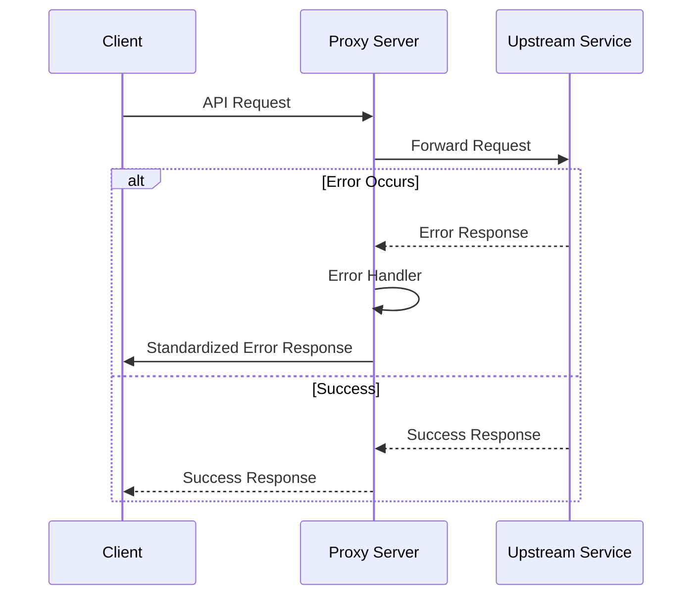
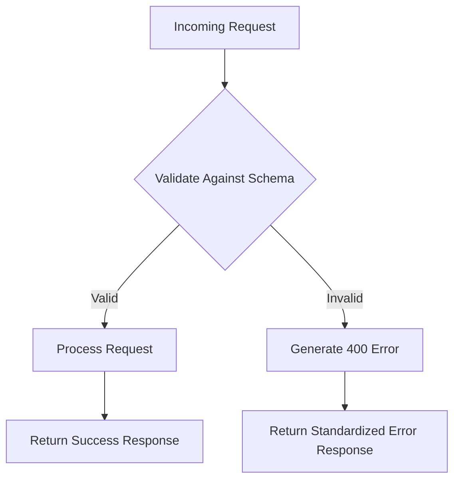
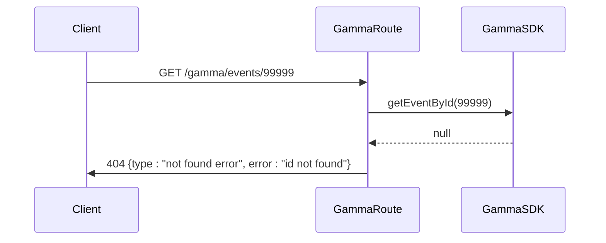
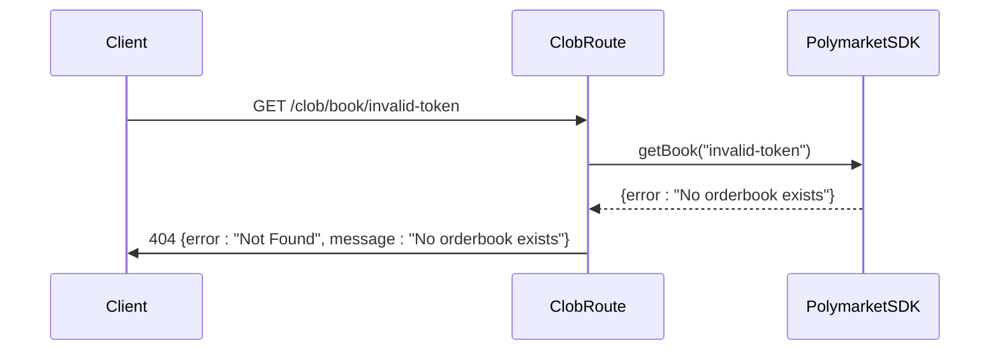
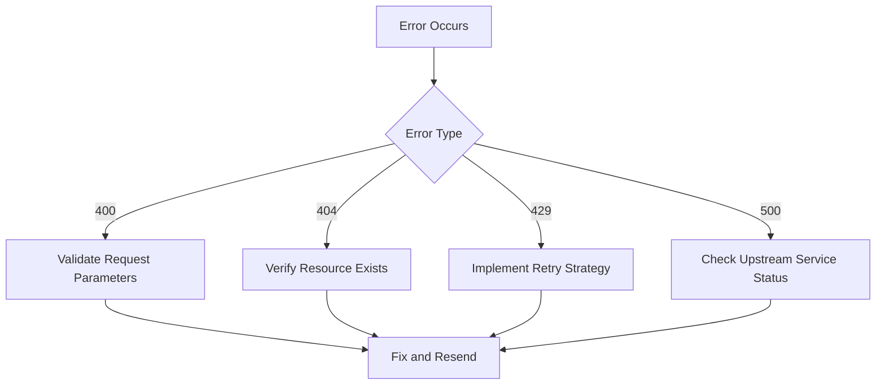

# API Errors

<cite>
**Referenced Files in This Document**   
- [index.ts](file://src/index.ts)
- [elysia-schemas.ts](file://src/types/elysia-schemas.ts)
- [gamma.ts](file://src/routes/gamma.ts)
- [clob.ts](file://src/routes/clob.ts)
</cite>

## Table of Contents
1. [Introduction](#introduction)
2. [Error Categories](#error-categories)
3. [Error Handling Middleware](#error-handling-middleware)
4. [Request Validation with Zod Schemas](#request-validation-with-zod-schemas)
5. [Gamma API Error Responses](#gamma-api-error-responses)
6. [CLOB API Error Responses](#clob-api-error-responses)
7. [Upstream Error Interpretation](#upstream-error-interpretation)
8. [Common Error Scenarios and Solutions](#common-error-scenarios-and-solutions)
9. [Best Practices for Error Handling](#best-practices-for-error-handling)
10. [Troubleshooting Guide](#troubleshooting-guide)

## Introduction
This document provides comprehensive guidance on handling API errors in the Polymarket proxy server. It covers error categories, middleware implementation, validation schemas, and specific error responses from both the proxy server and upstream Polymarket services. The documentation details how the Elysia framework transforms and propagates errors, how request validation generates specific error messages, and provides practical solutions for common error scenarios.

## Error Categories
The Polymarket proxy server handles several categories of API errors, each with distinct characteristics and handling mechanisms:

- **400 (Validation Errors)**: Occur when request parameters or body fail validation against defined schemas
- **404 (Not Found Errors)**: Triggered when requested resources cannot be found in upstream services
- **429 (Rate Limiting)**: Indicates that rate limits have been exceeded
- **500 (Server Errors)**: Represent internal server errors or unexpected failures in upstream services

These error categories are consistently handled across both the Gamma and CLOB APIs, with standardized response formats that facilitate client-side error handling and debugging.

**Section sources**
- [index.ts](file://src/index.ts#L102-L150)
- [elysia-schemas.ts](file://src/types/elysia-schemas.ts#L350-L370)

## Error Handling Middleware
The Elysia error handling middleware in `src/index.ts` serves as the central mechanism for transforming and propagating errors throughout the proxy server. This global error handler intercepts all errors and converts them into standardized JSON responses with appropriate HTTP status codes.

The middleware handles several error codes:
- **VALIDATION**: Maps to 400 status with detailed validation failure information
- **NOT_FOUND**: Maps to 404 status when resources are not found
- **PARSE**: Maps to 400 status for invalid JSON in request bodies
- **Default**: Maps to 500 status for all other unexpected errors

Each error response includes an error type, message, and optional details to aid in debugging. The middleware also logs errors to the console with their code and message for server-side monitoring.



**Diagram sources**
- [index.ts](file://src/index.ts#L102-L150)

**Section sources**
- [index.ts](file://src/index.ts#L102-L150)

## Request Validation with Zod Schemas
Request validation is implemented using zod schemas defined in `src/types/elysia-schemas.ts`. These schemas provide comprehensive validation for both request parameters and bodies across all API endpoints.

Key validation schemas include:
- **MarketQuerySchema**: Validates query parameters for market data requests
- **EventQuerySchema**: Validates query parameters for event data requests
- **PriceHistoryQuerySchema**: Validates parameters for price history requests
- **ClobClientConfigSchema**: Validates CLOB client configuration

The validation system ensures that all incoming requests conform to expected formats before being processed. When validation fails, the Elysia framework automatically triggers the VALIDATION error code, which is then handled by the global error middleware to return a 400 response with descriptive error information.



**Diagram sources**
- [elysia-schemas.ts](file://src/types/elysia-schemas.ts#L150-L350)

**Section sources**
- [elysia-schemas.ts](file://src/types/elysia-schemas.ts#L150-L350)

## Gamma API Error Responses
The Gamma API routes in `src/routes/gamma.ts` implement specific error handling patterns for various endpoints. These routes use the GammaSDK to communicate with upstream services and handle errors appropriately.

For 404 errors, the Gamma API returns a specific error format:
```json
{
  "type": "not found error",
  "error": "id not found"
}
```

This format is used when attempting to retrieve resources by ID or slug that do not exist. The error response is returned with a 404 status code and includes both a type and error message to help clients distinguish between different types of not-found scenarios.

The Gamma API also handles 500 errors by returning a standardized error response format that includes error and message fields, consistent with the global error handling strategy.



**Diagram sources**
- [gamma.ts](file://src/routes/gamma.ts#L150-L200)

**Section sources**
- [gamma.ts](file://src/routes/gamma.ts#L150-L200)
- [elysia-schemas.ts](file://src/types/elysia-schemas.ts#L350-L370)

## CLOB API Error Responses
The CLOB API routes in `src/routes/clob.ts` implement robust error handling for trading and price history operations. These routes use the PolymarketSDK to interact with the CLOB service and handle various error scenarios.

For order book requests, the CLOB API distinguishes between different types of 404 errors:
- **No orderbook exists**: Returns a 404 status when no order book is available for a token
- **Invalid parameters**: Returns a 400 status for malformed requests

The price history endpoint (`/clob/prices-history`) handles validation errors by returning 400 responses with detailed error messages. It also handles upstream errors by catching exceptions and returning 500 responses with appropriate error messages.

Rate limiting is handled by the upstream CLOB service, with the proxy server propagating 429 responses directly to clients. Clients should implement appropriate retry strategies with exponential backoff when encountering rate limit errors.



**Diagram sources**
- [clob.ts](file://src/routes/clob.ts#L150-L200)

**Section sources**
- [clob.ts](file://src/routes/clob.ts#L150-L200)

## Upstream Error Interpretation
Interpreting upstream Polymarket error messages requires understanding both the proxy server's error transformation and the original upstream errors. The proxy server logs include correlation between upstream responses and transformed error responses, enabling effective debugging.

When analyzing proxy logs, look for:
- **Error codes**: Match Elysia error codes (VALIDATION, NOT_FOUND, etc.) with HTTP status codes
- **Error messages**: Examine the details field for specific validation failures or upstream error messages
- **Request parameters**: Review the original request to identify potential issues with input data

For 400 errors, check the request parameters against the relevant zod schema to identify validation failures. For 500 errors, examine the error message for clues about upstream service issues. For 404 errors, verify that the requested resource actually exists in the Polymarket system.

Correlating upstream errors with proxy logs involves tracing the request flow from client to upstream service and back, noting any transformations applied by the error handling middleware.

**Section sources**
- [index.ts](file://src/index.ts#L102-L150)
- [clob.ts](file://src/routes/clob.ts#L150-L200)
- [gamma.ts](file://src/routes/gamma.ts#L150-L200)

## Common Error Scenarios and Solutions
Several common error scenarios occur when interacting with the Polymarket APIs. Understanding these scenarios and their solutions can prevent many common issues.

### Malformed Slugs
When using slug-based endpoints, ensure that slugs are properly URL-encoded and match the exact format used by Polymarket. Invalid slugs return 404 errors.

**Solution**: Validate slugs against known patterns and handle encoding properly.

### Invalid Time Ranges
Price history requests with invalid time ranges (e.g., start date after end date) trigger validation errors.

**Solution**: Implement client-side validation to ensure start dates precede end dates and use consistent date formats.

### Rate Limiting
Frequent requests to the CLOB API may trigger rate limiting (429 errors).

**Solution**: Implement exponential backoff retry strategies and cache responses when appropriate.

### Missing Authentication Headers
In production, CLOB API endpoints require authentication headers.

**Solution**: Always include x-polymarket-key and x-polymarket-funder headers in production requests.



**Diagram sources**
- [clob.ts](file://src/routes/clob.ts#L500-L550)
- [gamma.ts](file://src/routes/gamma.ts#L500-L550)

**Section sources**
- [clob.ts](file://src/routes/clob.ts#L500-L550)
- [gamma.ts](file://src/routes/gamma.ts#L500-L550)

## Best Practices for Error Handling
Implementing effective error handling requires following several best practices:

### Input Sanitization
Always sanitize input parameters before sending requests to the proxy server. This includes:
- URL-encoding special characters
- Validating data types and formats
- Checking value ranges for numeric parameters

### Query Parameter Formatting
Ensure query parameters are properly formatted according to the API specifications:
- Use consistent date formats (ISO 8601 recommended)
- Convert boolean values to strings when required
- Properly encode array parameters

### Retry Strategies
Implement intelligent retry strategies for transient errors:
- Use exponential backoff for rate limiting errors
- Limit the number of retry attempts
- Add jitter to prevent thundering herd problems

### Error Monitoring
Set up comprehensive error monitoring to track:
- Error frequency by type and endpoint
- Common error patterns
- Upstream service reliability

These practices help ensure robust client applications that can gracefully handle various error scenarios.

**Section sources**
- [clob.ts](file://src/routes/clob.ts#L150-L200)
- [gamma.ts](file://src/routes/gamma.ts#L150-L200)

## Troubleshooting Guide
This troubleshooting guide addresses common issues encountered when working with the Polymarket proxy server.

### Validation Errors (400)
When receiving 400 errors, check:
- Request parameters against the relevant zod schema
- JSON body structure and data types
- Required headers and their formats

Use the details field in the error response to identify specific validation failures.

### Not Found Errors (404)
For 404 errors:
- Verify the resource ID or slug is correct
- Check for typos in URL paths
- Confirm the resource exists in the Polymarket system

### Server Errors (500)
When encountering 500 errors:
- Check proxy server logs for detailed error messages
- Verify upstream service availability
- Test with simpler requests to isolate the issue

### Rate Limiting (429)
To handle rate limiting:
- Implement exponential backoff with jitter
- Cache responses to reduce request frequency
- Monitor request rates and adjust accordingly

The proxy server's standardized error responses make it easier to implement automated error handling and recovery strategies in client applications.

**Section sources**
- [index.ts](file://src/index.ts#L102-L150)
- [clob.ts](file://src/routes/clob.ts#L150-L200)
- [gamma.ts](file://src/routes/gamma.ts#L150-L200)