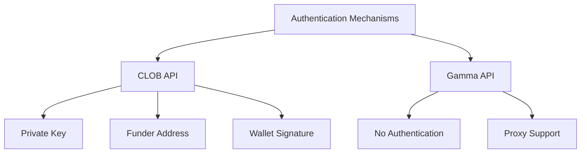
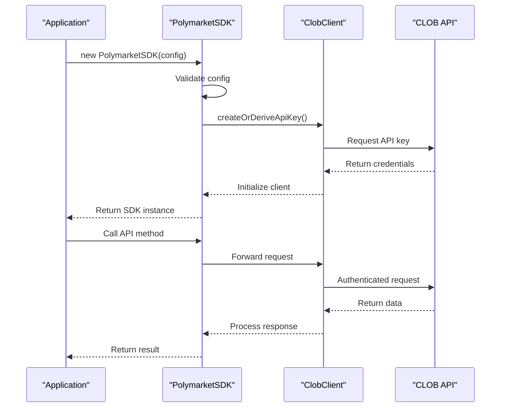
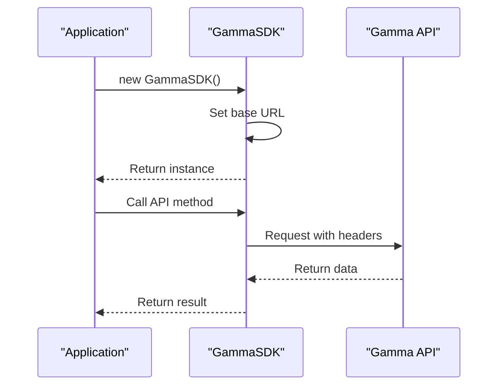
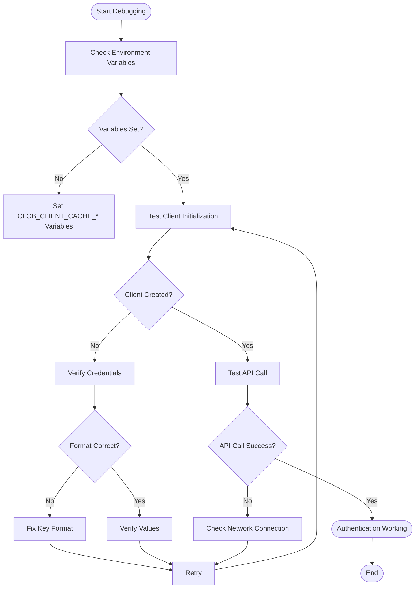

# Authentication Issues

<cite>
**Referenced Files in This Document**   
- [client.ts](file://src/sdk/client.ts)
- [gamma-client.ts](file://src/sdk/gamma-client.ts)
- [env.ts](file://src/utils/env.ts)
</cite>

## Table of Contents
1. [Introduction](#introduction)
2. [Authentication Mechanisms](#authentication-mechanisms)
3. [Common Authentication Issues](#common-authentication-issues)
4. [CLOB API Authentication](#clob-api-authentication)
5. [Gamma API Authentication](#gamma-api-authentication)
6. [Debugging Authentication Problems](#debugging-authentication-problems)
7. [Environment Configuration](#environment-configuration)
8. [Caching and Race Conditions](#caching-and-race-conditions)
9. [Cloudflare Worker Deployment](#cloudflare-worker-deployment)
10. [Troubleshooting Guide](#troubleshooting-guide)

## Introduction
This document provides comprehensive guidance on authentication-related issues in the polymarket-kit SDK. It covers both CLOB and Gamma APIs, detailing common problems, authentication mechanisms, and troubleshooting strategies. The content is designed to be accessible to beginners while providing deep technical insights for advanced users.

## Authentication Mechanisms

The polymarket-kit SDK implements different authentication mechanisms for its CLOB and Gamma APIs. The CLOB API requires authenticated access with wallet credentials, while the Gamma API provides public data access without authentication requirements.



**Diagram sources**
- [client.ts](file://src/sdk/client.ts#L1-L387)
- [gamma-client.ts](file://src/sdk/gamma-client.ts#L1-L891)

**Section sources**
- [client.ts](file://src/sdk/client.ts#L1-L387)
- [gamma-client.ts](file://src/sdk/gamma-client.ts#L1-L891)

## Common Authentication Issues

### Missing or Invalid API Keys
The most common authentication issue occurs when required credentials are missing or invalid. For the CLOB API, both privateKey and funderAddress are mandatory parameters.

### Incorrect Wallet Signatures
Wallet signature issues typically arise from incorrect private key formatting or chain ID mismatches. The SDK uses ethers.js Wallet for signature generation.

### Environment Variable Misconfigurations
Environment variables for cache configuration (CLOB_CLIENT_CACHE_MAX_SIZE, CLOB_CLIENT_CACHE_TTL_MINUTES) must be properly set to avoid unexpected behavior.

**Section sources**
- [client.ts](file://src/sdk/client.ts#L25-L100)
- [env.ts](file://src/utils/env.ts#L1-L12)

## CLOB API Authentication

The CLOB API requires authenticated access using wallet credentials. Authentication is handled through the PolymarketSDK class in the client.ts file.



**Diagram sources**
- [client.ts](file://src/sdk/client.ts#L50-L150)

**Section sources**
- [client.ts](file://src/sdk/client.ts#L1-L387)

## Gamma API Authentication

The Gamma API provides public data access without authentication requirements. However, it supports proxy configuration for network routing.



**Diagram sources**
- [gamma-client.ts](file://src/sdk/gamma-client.ts#L50-L100)

**Section sources**
- [gamma-client.ts](file://src/sdk/gamma-client.ts#L1-L891)

## Debugging Authentication Problems

### Verifying Key Formats
Ensure private keys are in the correct format (0x-prefixed hexadecimal string) and funder addresses are valid Ethereum addresses.

### Checking Environment Loading
Use console logs to verify environment variables are loaded correctly:



**Diagram sources**
- [client.ts](file://src/sdk/client.ts#L100-L150)
- [env.ts](file://src/utils/env.ts#L1-L12)

**Section sources**
- [client.ts](file://src/sdk/client.ts#L1-L387)
- [env.ts](file://src/utils/env.ts#L1-L12)

## Environment Configuration

### Required Environment Variables
- CLOB_CLIENT_CACHE_MAX_SIZE: Maximum number of cached CLOB clients
- CLOB_CLIENT_CACHE_TTL_MINUTES: Time-to-live for cached clients in minutes

### Testing with curl Commands
Test API connectivity using curl:

```bash
curl -H "Content-Type: application/json" \
  https://clob.polymarket.com/health
```

**Section sources**
- [client.ts](file://src/sdk/client.ts#L15-L25)
- [env.ts](file://src/utils/env.ts#L1-L12)

## Caching and Race Conditions

The SDK implements LRU caching for CLOB client instances to improve performance and reduce API key generation overhead.

```mermaid
classDiagram
class PolymarketSDK {
-config : ResolvedClobClientConfig
-cacheKey : string
+constructor(config)
-initializeClobClient()
+getPriceHistory(query)
+clearCache()
}
class LRUCache {
-max : number
-ttl : number
+get(key)
+set(key, value)
+delete(key)
+clear()
}
PolymarketSDK --> LRUCache : "uses"
LRUCache : +size : number
LRUCache : +max : number
```

**Diagram sources**
- [client.ts](file://src/sdk/client.ts#L15-L40)

**Section sources**
- [client.ts](file://src/sdk/client.ts#L1-L387)

## Cloudflare Worker Deployment

When deploying to Cloudflare Workers, secrets must be configured via wrangler.

### Wrangler Configuration
```toml
[vars]
PRIVATE_KEY = "your-private-key"
FUNDER_ADDRESS = "your-funder-address"

[secrets]
PRIVATE_KEY = "your-private-key-value"
FUNDER_ADDRESS = "your-funder-address-value"
```

### Accessing Secrets in Worker
```typescript
const privateKey = env.PRIVATE_KEY;
const funderAddress = env.FUNDER_ADDRESS;
```

**Section sources**
- [client.ts](file://src/sdk/client.ts#L25-L50)

## Troubleshooting Guide

### Missing Credentials Error
When encountering "Missing required configuration parameters" error:

1. Verify privateKey and funderAddress are provided
2. Check for typos in parameter names
3. Ensure values are not empty strings

### Failed Client Initialization
When CLOB client initialization fails:

1. Check private key format (must be 0x-prefixed)
2. Verify funder address is a valid Ethereum address
3. Confirm network connectivity
4. Check API endpoint availability

### Cache-Related Issues
For cache-related problems:

1. Monitor cache size with getCacheStats()
2. Clear cache with clearCache() when needed
3. Adjust cache TTL and max size via environment variables

**Section sources**
- [client.ts](file://src/sdk/client.ts#L150-L200)
- [gamma-client.ts](file://src/sdk/gamma-client.ts#L100-L150)