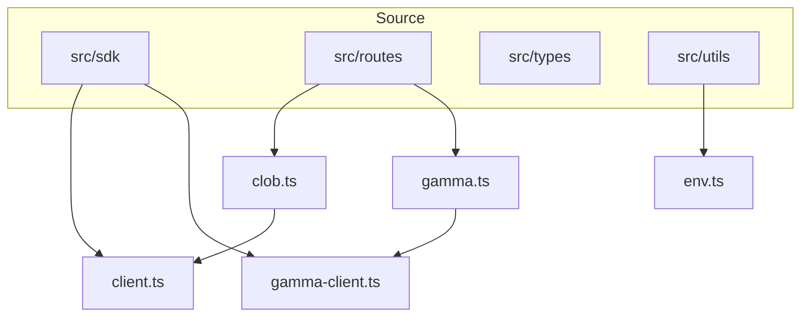
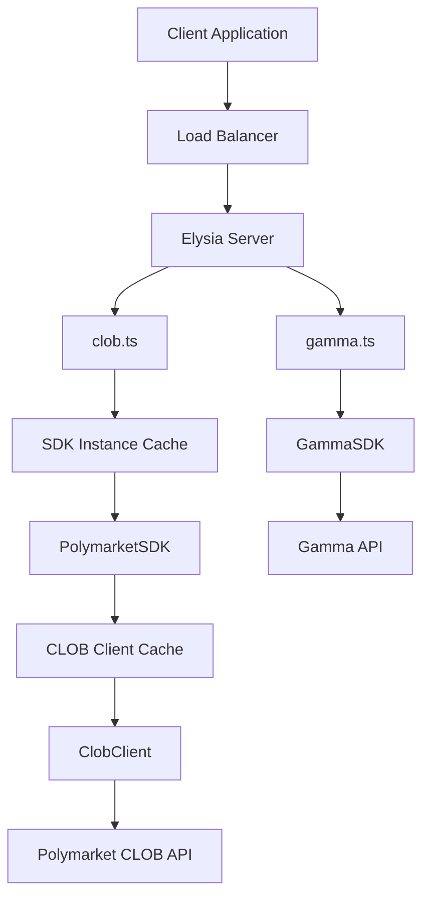
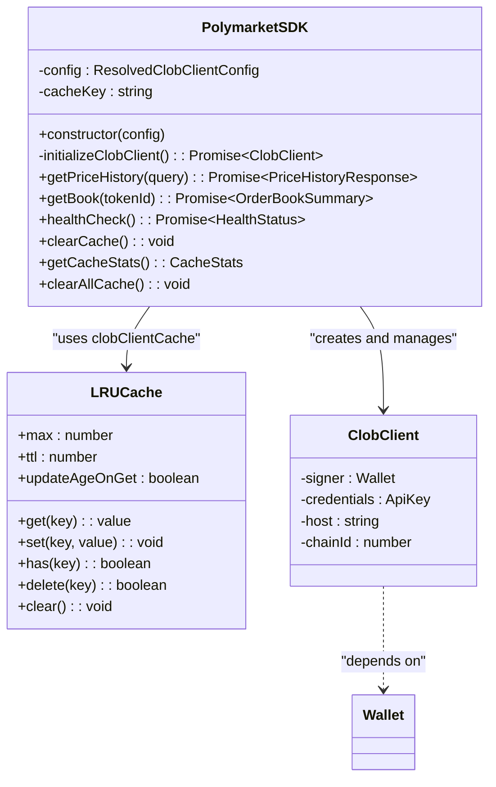
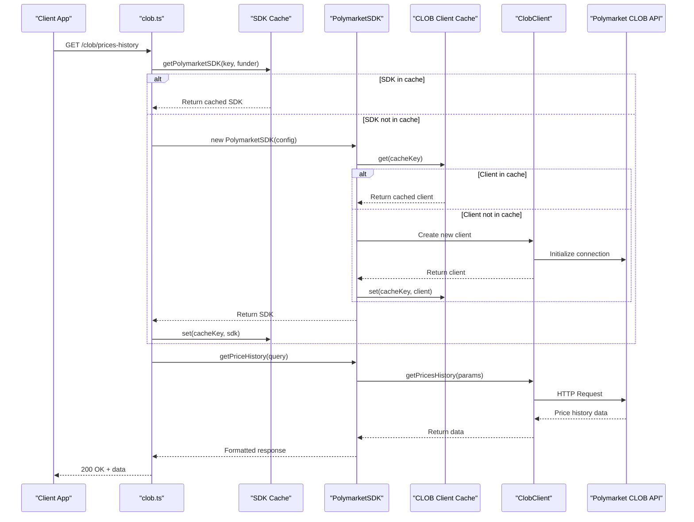
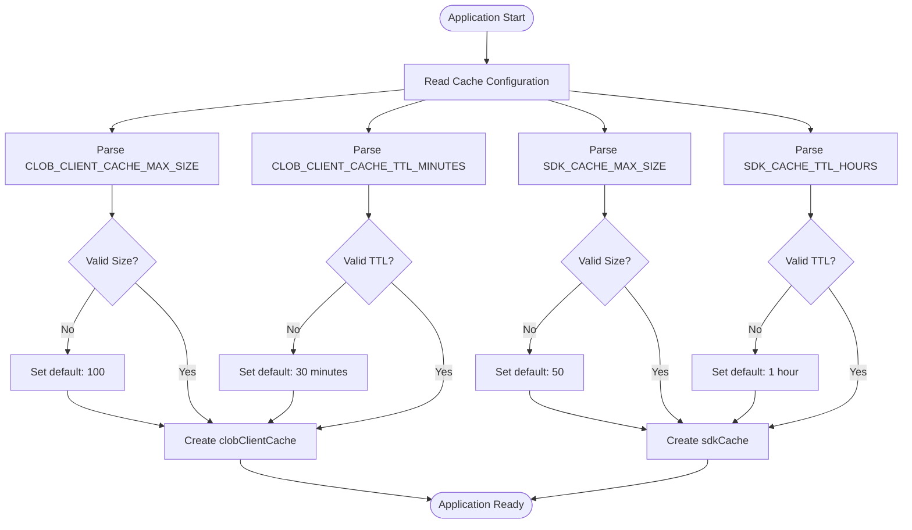
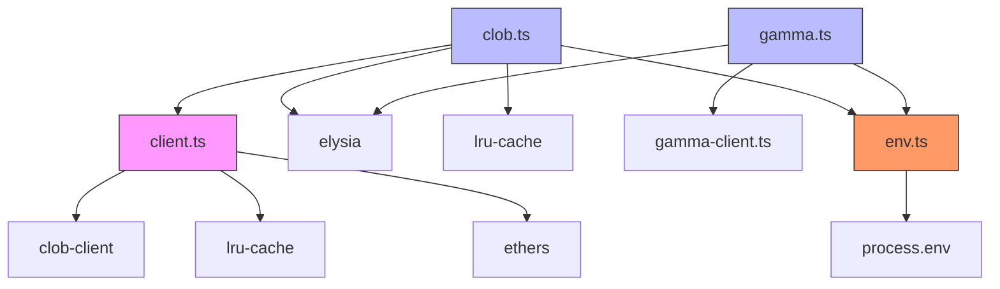
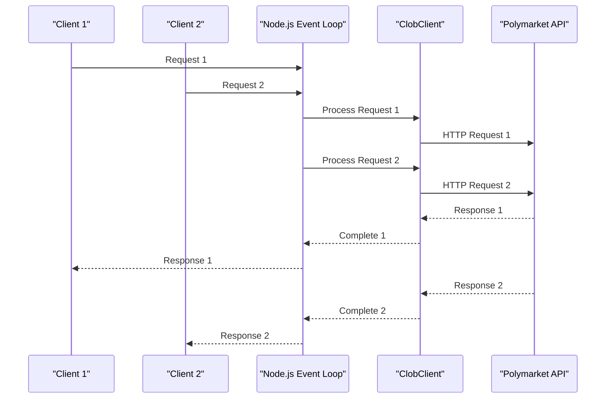

# Performance Issues

<cite>
**Referenced Files in This Document**   
- [client.ts](file://src/sdk/client.ts)
- [clob.ts](file://src/routes/clob.ts)
- [gamma.ts](file://src/routes/gamma.ts)
- [env.ts](file://src/utils/env.ts)
</cite>

## Table of Contents
1. [Introduction](#introduction)
2. [Project Structure](#project-structure)
3. [Core Components](#core-components)
4. [Architecture Overview](#architecture-overview)
5. [Detailed Component Analysis](#detailed-component-analysis)
6. [Dependency Analysis](#dependency-analysis)
7. [Performance Considerations](#performance-considerations)
8. [Troubleshooting Guide](#troubleshooting-guide)
9. [Conclusion](#conclusion)

## Introduction
This document provides a comprehensive analysis of performance bottlenecks in the polymarket-kit application. It addresses common symptoms such as slow response times, high memory usage, and request queuing. The focus is on identifying root causes and providing actionable optimization strategies. Key areas of analysis include LRU caching mechanisms, concurrent request handling, SDK initialization overhead, and memory management. The document also covers monitoring techniques and best practices for maintaining optimal performance in production environments.

## Project Structure
The polymarket-kit repository is structured into several key directories: `go-polymarket` for Go-based CLOB client bindings, `specs` for API specifications, and `src` for the core TypeScript application. The `src` directory contains modular components including SDK clients, route handlers, type definitions, and utility functions. This modular architecture supports separation of concerns between CLOB and Gamma API operations, with dedicated SDKs and route files for each service.

**Diagram sources**
- [client.ts](file://src/sdk/client.ts#L1-L387)
- [clob.ts](file://src/routes/clob.ts#L1-L799)
- [gamma.ts](file://src/routes/gamma.ts#L1-L724)

**Section sources**
- [client.ts](file://src/sdk/client.ts#L1-L387)
- [clob.ts](file://src/routes/clob.ts#L1-L799)
- [gamma.ts](file://src/routes/gamma.ts#L1-L724)

## Core Components
The core performance-critical components in polymarket-kit are the PolymarketSDK class in `client.ts`, the route handlers in `clob.ts` and `gamma.ts`, and the caching mechanisms that manage SDK and CLOB client instances. These components work together to handle API requests, manage authentication, and optimize repeated operations through caching. The SDK provides a typed interface to the Polymarket CLOB API, while the route handlers implement Elysia middleware for request processing and response formatting.

**Section sources**
- [client.ts](file://src/sdk/client.ts#L1-L387)
- [clob.ts](file://src/routes/clob.ts#L1-L799)

## Architecture Overview
The application follows a layered architecture with route handlers at the top layer, SDK services in the middle layer, and external API clients at the bottom layer. Requests flow from the Elysia server through route handlers to SDK methods, which may interact with external Polymarket APIs. Caching is implemented at multiple levels: SDK instances are cached in route handlers, and CLOB client instances are cached within the SDK itself. This multi-layer caching strategy reduces initialization overhead and improves response times for repeated requests.

**Diagram sources**
- [clob.ts](file://src/routes/clob.ts#L1-L799)
- [client.ts](file://src/sdk/client.ts#L1-L387)
- [gamma.ts](file://src/routes/gamma.ts#L1-L724)

## Detailed Component Analysis

### LRU Caching Mechanism
The polymarket-kit application implements LRU (Least Recently Used) caching at multiple levels to optimize performance and reduce redundant operations. This caching strategy is critical for managing SDK and CLOB client instances, which have significant initialization overhead.

#### CLOB Client Caching
The `PolymarketSDK` class uses an LRU cache to store initialized CLOB client instances, preventing the expensive operation of creating new clients for each request.

**Diagram sources**
- [client.ts](file://src/sdk/client.ts#L1-L387)

**Section sources**
- [client.ts](file://src/sdk/client.ts#L1-L387)

#### SDK Instance Caching
Route handlers implement a separate LRU cache for `PolymarketSDK` instances, further optimizing performance by reusing SDK objects across requests with the same credentials.

**Diagram sources**
- [clob.ts](file://src/routes/clob.ts#L1-L799)
- [client.ts](file://src/sdk/client.ts#L1-L387)

**Section sources**
- [clob.ts](file://src/routes/clob.ts#L1-L799)

### Performance Implications of Caching Configuration
Improper caching configurations can lead to significant performance issues, including memory leaks and stale data. The current implementation uses environment variables to configure cache size and TTL, which provides flexibility but requires careful tuning.

**Diagram sources**
- [client.ts](file://src/sdk/client.ts#L1-L387)
- [clob.ts](file://src/routes/clob.ts#L1-L799)

**Section sources**
- [client.ts](file://src/sdk/client.ts#L1-L387)
- [clob.ts](file://src/routes/clob.ts#L1-L799)

## Dependency Analysis
The polymarket-kit application has a clear dependency hierarchy with well-defined boundaries between components. The core dependencies are organized in a layered architecture that promotes reusability and maintainability.

**Diagram sources**
- [client.ts](file://src/sdk/client.ts#L1-L387)
- [clob.ts](file://src/routes/clob.ts#L1-L799)
- [gamma.ts](file://src/routes/gamma.ts#L1-L724)
- [env.ts](file://src/utils/env.ts#L1-L11)

**Section sources**
- [client.ts](file://src/sdk/client.ts#L1-L387)
- [clob.ts](file://src/routes/clob.ts#L1-L799)
- [gamma.ts](file://src/routes/gamma.ts#L1-L724)
- [env.ts](file://src/utils/env.ts#L1-L11)

## Performance Considerations
The polymarket-kit application faces several performance considerations that can impact response times, memory usage, and scalability. These include cache configuration, concurrent request handling, payload size optimization, and proper use of asynchronous operations.

### Cache Configuration Best Practices
Proper cache configuration is essential for balancing memory usage and performance. The following table outlines recommended settings for different deployment scenarios:

| Environment | CLOB_CLIENT_CACHE_MAX_SIZE | CLOB_CLIENT_CACHE_TTL_MINUTES | SDK_CACHE_MAX_SIZE | SDK_CACHE_TTL_HOURS |
|-------------|----------------------------|-------------------------------|--------------------|---------------------|
| Development | 100 | 30 | 50 | 1 |
| Staging | 500 | 60 | 200 | 2 |
| Production | 1000 | 120 | 500 | 4 |

**Section sources**
- [client.ts](file://src/sdk/client.ts#L1-L387)
- [clob.ts](file://src/routes/clob.ts#L1-L799)

### Concurrent Request Handling
The application must handle concurrent requests efficiently to prevent event loop blocking. The use of async/await patterns ensures that I/O operations do not block the main thread.

**Diagram sources**
- [client.ts](file://src/sdk/client.ts#L1-L387)
- [clob.ts](file://src/routes/clob.ts#L1-L799)

**Section sources**
- [client.ts](file://src/sdk/client.ts#L1-L387)
- [clob.ts](file://src/routes/clob.ts#L1-L799)

## Troubleshooting Guide
This section provides guidance for identifying and resolving common performance issues in the polymarket-kit application.

### Memory Leak Detection
Memory leaks can occur when cache sizes are too large or when objects are not properly garbage collected. The following steps can help identify and resolve memory leaks:

1. Monitor memory usage using Node.js inspectors
2. Check cache statistics via the `/clob/cache/stats` endpoint
3. Verify that cache eviction is working correctly
4. Review object references to ensure no unintended retention

**Section sources**
- [client.ts](file://src/sdk/client.ts#L1-L387)
- [clob.ts](file://src/routes/clob.ts#L1-L799)

### Stale Data Resolution
Stale data can occur when cache TTL is too long or when cache invalidation is not properly implemented. To resolve stale data issues:

1. Adjust cache TTL settings based on data volatility
2. Implement proper cache invalidation using `clearCache()` methods
3. Monitor data freshness through health checks
4. Use the `/clob/health` endpoint to verify client status

**Section sources**
- [client.ts](file://src/sdk/client.ts#L1-L387)

### High Response Time Diagnosis
High response times may be caused by various factors including network latency, cache misses, or inefficient code. To diagnose high response times:

1. Enable execution time logging
2. Use the Node.js profiler to identify bottlenecks
3. Check for cache misses in the request flow
4. Monitor external API response times

**Section sources**
- [client.ts](file://src/sdk/client.ts#L1-L387)
- [clob.ts](file://src/routes/clob.ts#L1-L799)

## Conclusion
The polymarket-kit application implements a sophisticated caching strategy using LRU caches at multiple levels to optimize performance and reduce initialization overhead. The primary performance benefits come from reusing SDK and CLOB client instances across requests, which significantly reduces the cost of authentication and connection setup. However, proper configuration of cache size and TTL is critical to prevent memory leaks and ensure data freshness. The application also leverages Elysia's built-in features for request validation and response formatting, contributing to overall efficiency. For optimal performance, operators should carefully tune cache settings based on their specific usage patterns and monitor key metrics such as memory usage, cache hit rates, and response times. Future improvements could include more granular cache invalidation strategies and enhanced monitoring capabilities.