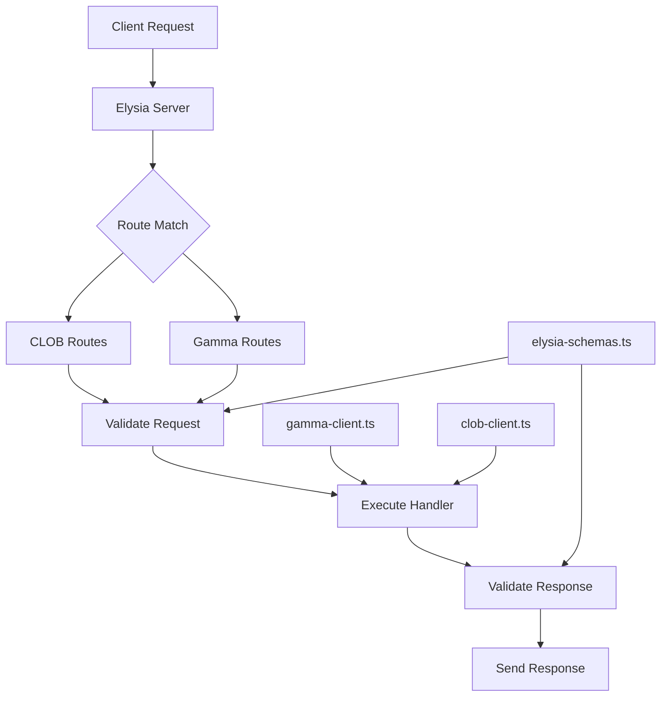
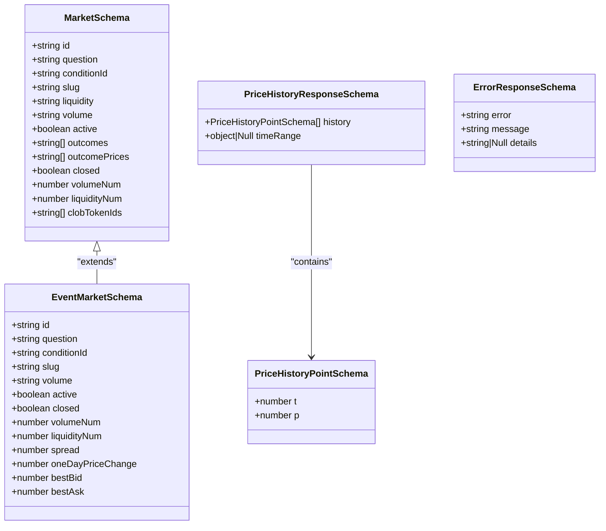
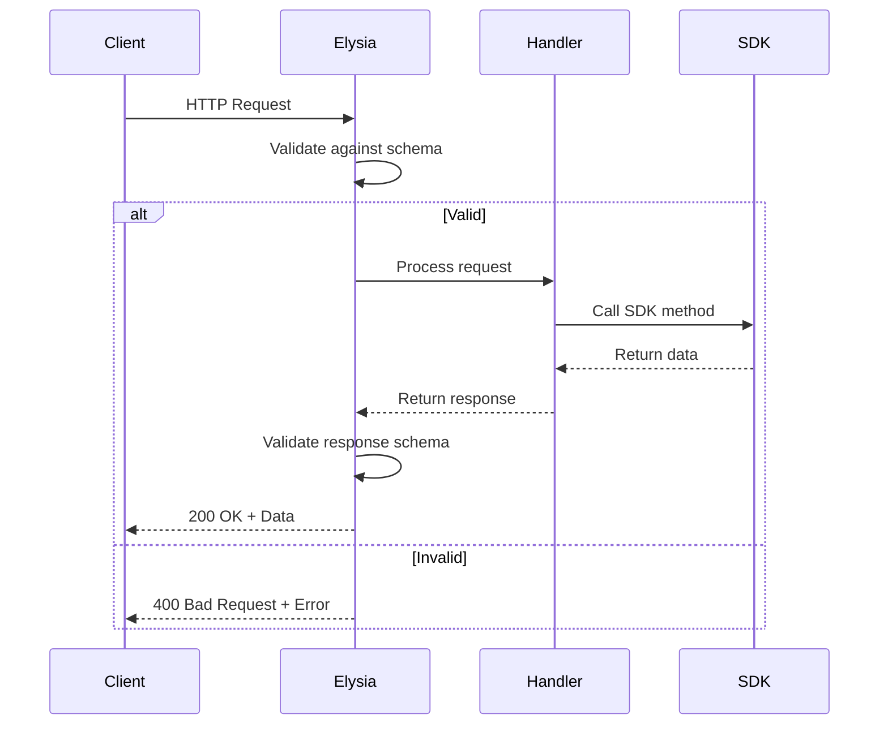
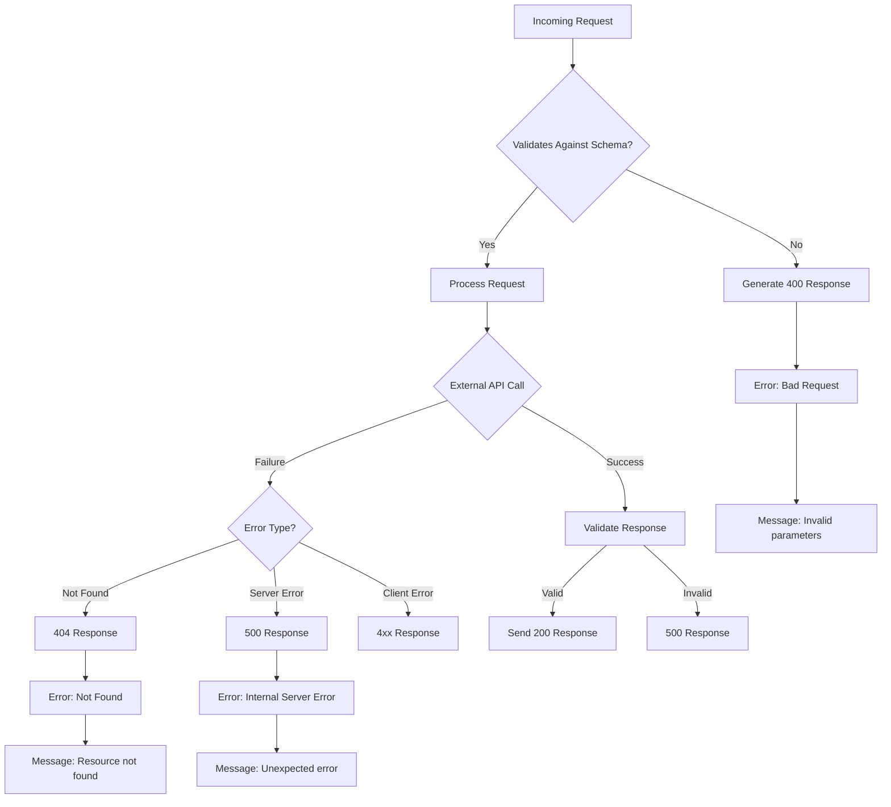

# Type Safety and Validation

<cite>
**Referenced Files in This Document**   
- [elysia-schemas.ts](file://src/types/elysia-schemas.ts)
- [clob.ts](file://src/routes/clob.ts)
- [gamma.ts](file://src/routes/gamma.ts)
- [gamma-client.ts](file://src/sdk/gamma-client.ts)
- [index.ts](file://src/index.ts)
</cite>

## Table of Contents
1. [Introduction](#introduction)
2. [Core Components](#core-components)
3. [Schema Design Patterns](#schema-design-patterns)
4. [Integration with Elysia.js](#integration-with-elysiajs)
5. [Error Handling and Validation](#error-handling-and-validation)
6. [Developer Experience](#developer-experience)
7. [Performance and Best Practices](#performance-and-best-practices)
8. [Extending and Modifying Schemas](#extending-and-modifying-schemas)
9. [Conclusion](#conclusion)

## Introduction

The Polymarket proxy server implements a comprehensive type safety and validation system using Elysia.js and TypeBox schemas. This system ensures that all API requests and responses adhere to strict contracts, providing runtime validation and compile-time type inference. The architecture centers around the `elysia-schemas.ts` file, which serves as the single source of truth for all data structures across the application.

The validation system operates at multiple levels: request parameters, query strings, request bodies, and response payloads. By leveraging Elysia's built-in validation capabilities, the system automatically enforces these contracts and generates appropriate HTTP error responses when validation fails. This approach eliminates the need for manual validation logic throughout the codebase, reducing bugs and improving maintainability.

The system supports both the CLOB API (requiring authentication) and Gamma API (public data) with distinct schema requirements for each. The design emphasizes reusability through base types and composite schemas, allowing for consistent validation patterns across endpoints while accommodating specific requirements for different data types such as market data, price history, order books, and error responses.

**Section sources**
- [elysia-schemas.ts](file://src/types/elysia-schemas.ts#L0-L50)
- [index.ts](file://src/index.ts#L0-L25)

## Core Components

The type safety system consists of several interconnected components that work together to provide comprehensive validation. At the core is the `elysia-schemas.ts` file, which defines all TypeBox schemas used throughout the application. These schemas are then consumed by route handlers in `clob.ts` and `gamma.ts` to enforce request and response contracts.

The system leverages Elysia's middleware capabilities to create SDK instances with proper typing, as seen in the `gammaRoutes` and `clobRoutes` implementations. For the CLOB API, the system handles authentication through headers or environment variables, with validation ensuring required credentials are present. The Gamma API implementation includes proxy support, allowing requests to be routed through intermediate servers when needed.

Each route definition includes comprehensive validation specifications for query parameters, request bodies, headers, and response formats. The system uses Elysia's response object to define multiple possible response types based on HTTP status codes, ensuring clients receive appropriately typed responses for both success and error conditions.

**Diagram sources**
- [elysia-schemas.ts](file://src/types/elysia-schemas.ts#L0-L1023)
- [clob.ts](file://src/routes/clob.ts#L0-L1013)
- [gamma.ts](file://src/routes/gamma.ts#L0-L725)

**Section sources**
- [elysia-schemas.ts](file://src/types/elysia-schemas.ts#L0-L1023)
- [clob.ts](file://src/routes/clob.ts#L0-L1013)
- [gamma.ts](file://src/routes/gamma.ts#L0-L725)

## Schema Design Patterns

The schema design follows several key patterns to ensure consistency, reusability, and maintainability across the codebase. Base types are defined at the top of `elysia-schemas.ts` to promote reuse across multiple schemas. These include `StringArray`, `OptionalString`, `OptionalNumber`, and `OptionalBoolean`, which standardize common type definitions throughout the application.

For market data, the system uses a hierarchical schema structure with `MarketSchema` as the primary definition, supplemented by related schemas like `EventMarketSchema` and `SeriesSchema`. These schemas share common fields while adding specific properties relevant to their context. The design accommodates both string and numeric representations of values (e.g., volume, liquidity) to handle the mixed data types returned by the underlying APIs.

Price history data follows a specialized pattern with `PriceHistoryPointSchema` defining individual data points and `PriceHistoryResponseSchema` wrapping these points in a response structure that includes optional time range metadata. The query schema for price history (`PriceHistoryQuerySchema`) demonstrates a sophisticated pattern that supports multiple ways to specify time ranges (Unix timestamps, date strings, or predefined intervals).

Error responses use a consistent pattern across the system, with `ErrorResponseSchema` providing a standard format for error messages and `GammaErrorResponseSchema` handling API-specific error formats. This approach ensures clients receive predictable error information regardless of which endpoint encounters an issue.

**Diagram sources**
- [elysia-schemas.ts](file://src/types/elysia-schemas.ts#L100-L500)

**Section sources**
- [elysia-schemas.ts](file://src/types/elysia-schemas.ts#L0-L1023)

## Integration with Elysia.js

The integration with Elysia.js provides automatic runtime validation and TypeScript type inference across all API endpoints. When defining routes, the system uses Elysia's schema validation options to specify the expected structure of requests and responses. This integration enables the framework to automatically validate incoming requests against the defined schemas and generate appropriate error responses when validation fails.

In the route definitions, validation is specified through the `query`, `body`, `params`, and `headers` properties of the route configuration object. For example, the `/clob/prices-history` endpoint uses `PriceHistoryQuerySchema` to validate query parameters and `PriceHistoryResponseSchema` to validate the response structure. This declarative approach eliminates the need for manual validation code within route handlers.

The system also leverages Elysia's type inference capabilities to provide compile-time type safety. When a schema is used in a route definition, Elysia automatically infers the TypeScript types for the corresponding request properties, ensuring that handler code operates on correctly typed data. This integration between runtime validation and compile-time type checking creates a robust type safety system that catches errors at both development and runtime.

Elysia's error handling middleware automatically converts validation failures into appropriate HTTP responses with status code 400, using the `VALIDATION` error code. This centralized error handling ensures consistent error responses across all endpoints without requiring individual route handlers to implement error handling logic.

**Diagram sources**
- [clob.ts](file://src/routes/clob.ts#L0-L1013)
- [gamma.ts](file://src/routes/gamma.ts#L0-L725)
- [index.ts](file://src/index.ts#L0-L166)

**Section sources**
- [clob.ts](file://src/routes/clob.ts#L0-L1013)
- [gamma.ts](file://src/routes/gamma.ts#L0-L725)

## Error Handling and Validation

The error handling system provides comprehensive validation and appropriate HTTP error responses for invalid requests. When a request fails validation against its defined schema, Elysia's built-in validation system automatically returns a 400 Bad Request response with detailed error information. The global error handler in `index.ts` standardizes these responses using the `ErrorResponseSchema` format.

For endpoints that interact with external APIs, the system implements additional error handling to transform API-specific errors into standardized HTTP responses. For example, when retrieving a market by ID from the Gamma API, if the market is not found, the system returns a 404 Not Found response with a standardized error format. This approach ensures clients receive consistent error information regardless of whether the error originated from request validation or an external API call.

The validation system handles various types of input errors, including missing required parameters, invalid data types, and values outside acceptable ranges. For complex validation scenarios, such as the price history endpoint that supports multiple ways to specify time ranges, the system validates that mutually exclusive parameters are not used together. This sophisticated validation logic is handled automatically by the schema definitions without requiring additional code in the route handlers.

Error responses include both a high-level error message and optional detailed information to help clients understand and resolve the issue. The system distinguishes between client errors (4xx status codes) and server errors (5xx status codes), providing appropriate guidance for each type of error. This comprehensive error handling approach improves the developer experience by making it easier to diagnose and fix issues when integrating with the API.

**Diagram sources**
- [index.ts](file://src/index.ts#L100-L160)
- [clob.ts](file://src/routes/clob.ts#L0-L1013)
- [gamma.ts](file://src/routes/gamma.ts#L0-L725)

**Section sources**
- [elysia-schemas.ts](file://src/types/elysia-schemas.ts#L800-L900)
- [index.ts](file://src/index.ts#L100-L160)

## Developer Experience

The type safety system significantly enhances the developer experience through autocomplete and type checking features. When consuming the API, developers benefit from full TypeScript type inference, enabling IDEs to provide accurate autocomplete suggestions for request parameters, query strings, and request bodies. This reduces the likelihood of errors and speeds up development by eliminating the need to constantly refer to documentation.

The integration with Elysia's OpenAPI and Swagger plugins automatically generates comprehensive API documentation available at the `/docs` endpoint. This documentation includes detailed information about each endpoint, including request parameters, response formats, and example requests and responses. The documentation is automatically kept in sync with the code, ensuring it remains accurate as the API evolves.

For developers working on the server-side code, the system provides compile-time type safety that catches errors during development rather than at runtime. When implementing new endpoints or modifying existing ones, the TypeScript compiler ensures that request handlers operate on correctly typed data as defined by the schemas. This reduces bugs and makes refactoring safer and more efficient.

The use of a single source of truth for schemas in `elysia-schemas.ts` simplifies maintenance and ensures consistency across the codebase. When a data structure needs to be modified, developers can update the schema in one location, and the changes are automatically reflected throughout the application. This approach reduces the risk of inconsistencies and makes it easier to evolve the API over time.

**Section sources**
- [elysia-schemas.ts](file://src/types/elysia-schemas.ts#L0-L1023)
- [index.ts](file://src/index.ts#L50-L100)

## Performance and Best Practices

The validation system is designed with performance considerations in mind, balancing thorough validation with efficient execution. Schema validation occurs early in the request lifecycle, preventing unnecessary processing of invalid requests. This approach conserves server resources and reduces response times for erroneous requests by failing fast.

The system follows best practices for schema composition and reuse by defining base types and building more complex schemas from these reusable components. This modular approach reduces code duplication and makes schemas easier to maintain. For example, the `OptionalString`, `OptionalNumber`, and `OptionalBoolean` types are reused across multiple schemas, ensuring consistency in how optional fields are handled.

To optimize performance, the system leverages caching at multiple levels. The CLOB API implementation uses an LRU cache to store SDK instances, reducing the overhead of creating new instances for each request. This caching strategy is particularly important for authenticated endpoints that require credential validation on each request.

When defining schemas, the system follows the principle of being explicit about data types and validation rules. This approach reduces ambiguity and ensures that both client and server have a shared understanding of the expected data format. The use of descriptive field names and comprehensive documentation comments in the schemas further enhances clarity and maintainability.

For high-frequency endpoints like price and order book queries, the system minimizes validation overhead by focusing on essential parameters. Complex validation is reserved for endpoints where data integrity is critical, such as those involving financial transactions. This balanced approach ensures robust validation where needed without introducing unnecessary overhead for high-performance endpoints.

**Section sources**
- [elysia-schemas.ts](file://src/types/elysia-schemas.ts#L0-L1023)
- [clob.ts](file://src/routes/clob.ts#L0-L1013)

## Extending and Modifying Schemas

Extending and modifying schemas in the system follows a structured approach that maintains type safety while accommodating new requirements. When adding new endpoints or modifying existing ones, developers should first update the relevant schema in `elysia-schemas.ts` to reflect the desired request or response structure. This single source of truth ensures that all parts of the system remain synchronized.

To extend existing schemas, developers can use TypeBox's composition utilities such as `t.Composite` to combine multiple schemas. For example, the event markdown endpoint combines `EventByIdQuerySchema` and `MarkdownOptionsSchema` using `t.Composite` to create a combined query schema. This approach allows for flexible schema composition without duplicating definitions.

When modifying existing schemas, it's important to consider backward compatibility, especially for public API endpoints. The system supports optional fields through `t.Optional`, allowing new fields to be added without breaking existing clients. For breaking changes, the recommended approach is to create a new version of the endpoint with a different path prefix rather than modifying the existing schema.

For custom use cases, developers can create new schemas in `elysia-schemas.ts` following the established patterns. Base types like `StringArray`, `OptionalString`, and `OptionalNumber` should be reused where applicable to maintain consistency. New schemas should include comprehensive documentation comments that describe their purpose and usage.

After modifying or extending schemas, developers should update the corresponding route definitions to use the new schemas and ensure that handler code properly handles the updated data structures. The TypeScript compiler will help identify any inconsistencies between the schema definitions and their usage in the code.

**Section sources**
- [elysia-schemas.ts](file://src/types/elysia-schemas.ts#L0-L1023)
- [gamma.ts](file://src/routes/gamma.ts#L0-L725)

## Conclusion

The type safety and validation system in the Polymarket proxy server provides a robust foundation for building reliable and maintainable APIs. By leveraging Elysia.js and TypeBox schemas, the system ensures that all requests and responses adhere to strict contracts, providing both runtime validation and compile-time type inference. This dual-layer approach catches errors early in the development process while also protecting against invalid data at runtime.

The architecture centers around a single source of truth for schemas, promoting consistency and reusability across the codebase. The integration with Elysia's validation system enables automatic request validation and error handling, reducing the need for manual validation code and ensuring consistent error responses. The system supports both authenticated (CLOB) and public (Gamma) APIs with appropriate validation rules for each.

Developers benefit from enhanced productivity through IDE autocomplete, type checking, and automatically generated documentation. The system's design accommodates extension and modification while maintaining type safety, making it adaptable to evolving requirements. Performance considerations are addressed through strategic caching and efficient validation, ensuring the system remains responsive even under heavy load.

Overall, this type safety system represents a best practice approach to API development, combining the strengths of TypeScript's type system with runtime validation to create a robust, maintainable, and developer-friendly API infrastructure.